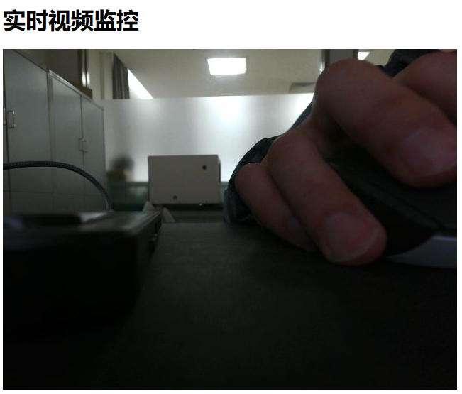

# cpp websocket minimal demo using uWebSockets

>  winxos 20250218

这个工程展示了c++环境下最简单实现websocket应用，采用了uWebSockets库。

编译环境采用vs2022+vcpkg,  /std:c++20，可以很方便的移植到其他平台。

接入usb摄像头，运行程序，浏览器访问 [localhost:9001](http://localhost:9001/) 就可以看到实时的视频流。

### english


This project demonstrates the simplest implementation of a WebSocket application in a C++ environment, utilizing the uWebSockets library.

The compilation environment uses VS2022 + vcpkg, with the C++20 standard (/std:c++20), making it easy to port to other platforms.

By connecting a USB camera and running the program, you can access the real-time video stream by visiting [localhost:9001](http://localhost:9001/) in your browser.



### all source code

```c++
#define _CRT_SECURE_NO_WARNINGS

#include <uWebSockets/App.h>
#include <opencv2/opencv.hpp>
#include <iostream>
#include <thread>
#include <mutex>
#include <set>
#include <chrono>

using namespace std;

struct PerSocketData {};

int main() {
    struct ConnectionManager {
        set<uWS::WebSocket<false, true, PerSocketData>*> connections;
        mutex connectionMutex;
    };

    ConnectionManager connManager;

    uWS::App app;

    // WebSocket配置
    app.ws<PerSocketData>("/*", {
        .open = [&connManager](auto* ws) {
            {
                lock_guard<mutex> lock(connManager.connectionMutex);
                connManager.connections.insert(ws);
            }
            cout << "WebSocket连接建立，当前连接数: " << connManager.connections.size() << endl;
        },
        .close = [&connManager](auto* ws, int code, string_view message) {
            {
                lock_guard<mutex> lock(connManager.connectionMutex);
                connManager.connections.erase(ws);
            }
            cout << "WebSocket连接关闭，剩余连接数: " << connManager.connections.size() << endl;
        }
        });

    // HTTP GET路由
    app.get("/status", [&connManager](auto* res, auto* req) {
        res->writeStatus("200 OK")
            ->writeHeader("Content-Type", "application/json")
            ->end(R"({"status": "running", "clients": ")" + to_string(connManager.connections.size()) + "\"}");
        });

    app.get("/", [](auto* res, auto* req) {
        res->writeStatus("200 OK")
            ->writeHeader("Content-Type", "text/html")
            ->end(R"(
<html>
<body>
    <h1>实时视频监控</h1>
    
    <script>
        const ws = new WebSocket('ws://localhost:9001/');
        ws.binaryType = 'arraybuffer';
        
        ws.onmessage = function(event) {
            if (typeof event.data === 'string') {
                console.log('收到数据:', event.data);
            } else {
                const blob = new Blob([event.data], {type: 'image/jpeg'});
                const url = URL.createObjectURL(blob);
                document.getElementById('videoFeed').src = url;
            }
        };
    </script>
</body>
</html>
)");
        });

    // 视频流推送线程
    thread([&connManager]() {
        cv::VideoCapture cap(0); // 使用摄像头，测试时可生成虚拟图像
        if (!cap.isOpened()) {
            cerr << "无法打开摄像头" << endl;
            return;
        }

        while (true) {
            cv::Mat frame;
            cap >> frame;
            if (frame.empty()) continue;

            // 编码为JPEG
            vector<uchar> jpegBuffer;
            cv::imencode(".jpg", frame, jpegBuffer, { cv::IMWRITE_JPEG_QUALITY, 80 });

            // 创建JSON数据
            auto timestamp = chrono::duration_cast<chrono::milliseconds>(
                chrono::system_clock::now().time_since_epoch()
            ).count();
            string jsonData = R"({"type": "frameInfo", "timestamp": )" + to_string(timestamp) + "}";

            // 广播数据
            {
                lock_guard<mutex> lock(connManager.connectionMutex);
                for (auto ws : connManager.connections) {
                    ws->send(string_view((char*)jpegBuffer.data(), jpegBuffer.size()), uWS::BINARY);
                    ws->send(jsonData, uWS::TEXT);
                }
            }

            this_thread::sleep_for(25ms);
        }
        }).detach();

        // 启动服务器
        app.listen(9001, [](auto* listenSocket) {
            if (listenSocket) {
                cout << "服务器已启动，监听端口 9001" << endl;
                cout << "测试地址: http://localhost:9001" << endl;
            }
            });

        app.run();
}

```

